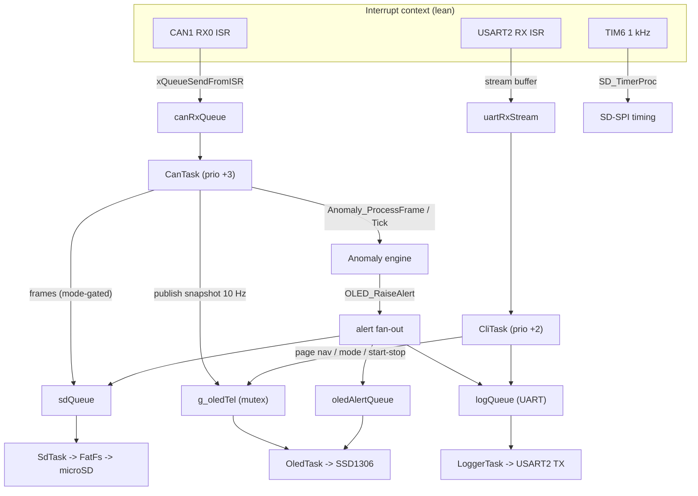

# i_CAN_hack — CAN Bus Logger & Vehicle Anomaly Detection System

A real-time **CAN bus logger, analyzer, and intrusion-detection node** for the
**STM32F446RE** (Nucleo-64). It captures and filters CAN traffic, benchmarks bus
throughput, injects arbitrary frames, detects anomalous activity (flooding,
unknown IDs, timing drift, payload tampering), visualizes everything on an
on-board OLED dashboard, and persists a full CSV log to an SD card.

Built on **FreeRTOS** with a clean producer/consumer task architecture, lean
interrupt handlers, and a single mutex-protected telemetry source of truth.

---

## Table of Contents

- [Overview](#overview)
- [Feature Summary](#feature-summary)
- [System Architecture](#system-architecture)
- [Hardware](#hardware)
- [Pin Map & Wiring](#pin-map--wiring)
- [Build & Flash](#build--flash)
- [UART Console](#uart-console)
- [OLED Dashboard](#oled-dashboard)
- [Anomaly Detection](#anomaly-detection)
- [SD-Card Logging](#sd-card-logging)
- [Configuration Reference](#configuration-reference)
- [Project Layout](#project-layout)
- [Troubleshooting](#troubleshooting)
- [Roadmap](#roadmap)
- [License](#license)

---

## Overview

`i_CAN_hack` turns a low-cost STM32 Nucleo board plus a CAN transceiver, an
SSD1306 OLED, and a microSD module into a self-contained CAN diagnostics and
security-monitoring tool — the kind of device you can wire into a vehicle or
test bench, leave running headless, and review later.

| | |
|---|---|
| **MCU** | STM32F446RET6 (Cortex-M4F @ 84 MHz) |
| **RTOS** | FreeRTOS (CMSIS-OS v1), 6 tasks |
| **Bus** | CAN @ 500 kbps (Normal mode) |
| **Console** | USART2 @ 115200 8N1 (ST-Link VCP) |
| **Display** | SSD1306 128×64 OLED over I²C1 @ 400 kHz |
| **Storage** | microSD (SPI, FatFs R0.12c, FAT32; ~328 kHz init, ~10.5 MHz data) |
| **Toolchain** | STM32CubeIDE / arm-none-eabi-gcc + GNU make |

---

## Feature Summary

- **Interrupt-driven CAN capture** — the RX FIFO0 ISR does nothing but push the
  frame onto a FreeRTOS queue; all processing happens in tasks.
- **Five operating modes** — Read-All, Read-Filtered, Speed-Test, Idle, Write.
- **Frame injection** — transmit arbitrary `ID DLC DATA…` frames from the console.
- **Vehicle anomaly detection** — four detectors (flood / unknown-ID / timing /
  payload) with automatic baseline learning and on-demand re-learning.
- **Multi-sink alerting** — anomalies are surfaced simultaneously on the **OLED
  alert page**, the **UART console**, and the **SD log**.
- **Page-based OLED dashboard** — Main, Filter, Speed, Stats, and an
  auto-overlay Alert page, with mode-follow + manual navigation.
- **Persistent CSV logging** — frames (mode-respecting) and all alerts are
  batched to `canlog.csv` with periodic flush for power-loss tolerance.
- **Live telemetry** — frames/sec, peak rate, totals, logged/filtered/dropped
  counters, all from one mutex-guarded source of truth.

---

## System Architecture

The firmware is a set of cooperating FreeRTOS tasks. Interrupt handlers are
intentionally minimal — they only move data into queues/stream buffers. No
display, file, or UART I/O ever happens in an ISR.



### Tasks

| Task | Prio | Role |
|------|------|------|
| `CanTask` | idle+3 | Drains `canRxQueue`, applies mode logic, runs anomaly detection, publishes telemetry, routes logged frames to SD/UART |
| `CliTask` | idle+2 | UART menu / command state machine, page navigation, mode + logging control |
| `LoggerTask` | idle+1 | **Sole UART-TX owner**; drains `logQueue`, emits speed-test rate |
| `OledTask` | idle+1 | Page dispatcher; renders the active dashboard page at 10 Hz |
| `SdTask` | idle+1 | Mounts the card, batches CSV writes, periodic `f_sync` |
| `StatsTask` | idle+1 | Periodic stats line; precise period via `vTaskDelayUntil` |

### Concurrency model

- **Single source of truth:** `g_oledTel` (an `OledTelemetry_t`) holds everything
  displayed. `CanTask` keeps cheap local counters and publishes a snapshot under
  `g_oledMutex` every 100 ms — the mutex is contended ~10×/s, never per frame.
- **Alerts** flow through a dedicated `oledAlertQueue`; the OLED task drains it,
  overlays the Alert page for 3 s, then returns to the previous page.
- **No shared peripheral is touched from two tasks** — UART TX is owned by
  `LoggerTask`, the OLED by `OledTask`, the SD card by `SdTask`.

---

## Hardware

| Component | Notes |
|-----------|-------|
| **STM32F446RE Nucleo-64** | Core MCU board |
| **CAN transceiver** | TJA1050 / MCP2551 / SN65HVD230 — the MCU has no PHY |
| **SSD1306 OLED** | 128×64, I²C, address `0x3C` |
| **microSD module** | SPI breakout (CS/SCK/MOSI/MISO/VCC/GND), FAT32 card |
| **CAN bus termination** | 120 Ω at each physical end of the bus |

> **Power note (microSD module):** the common breakouts have an onboard 3.3 V
> regulator + level shifter and expect **5 V on VCC** — feed the module's VCC
> from the Nucleo **5V** pin, not 3V3. Powering VCC from 3.3 V drops the card's
> rail to ~2.2 V after the regulator and the card fails to initialise (it
> answers CMD0/CMD8 but stalls during ACMD41). A bare 3.3 V-native adapter
> (no regulator chip) is the exception — that one takes 3.3 V.

---

## Pin Map & Wiring

| Function | MCU Pin | Peripheral | Connect to |
|----------|---------|------------|------------|
| CAN TX | PA12 | CAN1_TX | Transceiver TXD |
| CAN RX | PA11 | CAN1_RX | Transceiver RXD |
| Console TX | PA2 | USART2_TX | ST-Link VCP (on-board) |
| Console RX | PA3 | USART2_RX | ST-Link VCP (on-board) |
| OLED SCL | PB6 | I²C1_SCL | OLED SCL |
| OLED SDA | PB7 | I²C1_SDA | OLED SDA |
| SD SCK | PA5 | SPI1_SCK | microSD SCK |
| SD MISO | PA6 | SPI1_MISO | microSD MISO |
| SD MOSI | PA7 | SPI1_MOSI | microSD MOSI |
| SD CS | PA4 | GPIO out | microSD CS |

> **Note:** PA5 is the Nucleo's user LED *and* SPI1_SCK. Because the SD card
> uses PA5 for clock, the LED heartbeat is disabled in firmware — liveness is
> shown by the OLED spinner instead.

Power the **OLED from 3.3 V**, and the **SD module from 5 V** (see the power note
above — the regulated SD breakouts need 5 V on VCC).

---

## Build & Flash

### Generating code with STM32CubeMX

All peripheral and middleware init is owned by **STM32CubeMX** via the
`i_CAN_hack.ioc` project file. If you change pins, clocks, or peripherals, do it
in the CubeMX GUI and regenerate — don't hand-edit the generated init. The
application logic lives inside `/* USER CODE BEGIN ... */ … /* USER CODE END ... */`
guards, so it survives regeneration.

1. Open **`i_CAN_hack.ioc`** in STM32CubeMX (or the CubeMX perspective inside
   STM32CubeIDE).
2. The project is already configured — CAN1 (500 kbps), USART2 (115200), I2C1
   (OLED), SPI1 (SD), FATFS, and FreeRTOS (CMSIS-V1). Key settings to keep if you
   regenerate from scratch:
   - **CAN1_RX0** and **USART2** NVIC priority set to **6** (must be ≥ 5 so the
     ISRs can safely call FreeRTOS `...FromISR` APIs).
   - HAL timebase on **TIM6** (FreeRTOS owns SysTick).
   - `INCLUDE_vTaskDelayUntil = 1` in the FreeRTOS config.
3. Click **Generate Code**.
4. Build & flash with either option below.

> Note: the application sources under `Core/App/` (`anomaly.c`, `sd_logger.c`,
> `sd_spi.c`, `ssd1306*.c`) live outside CubeMX's view. If you regenerate the
> CubeIDE build tree, make sure they're still included in the project / `Debug/`
> makefiles.

### Option A — STM32CubeIDE (GUI)

1. Import the project into **STM32CubeIDE** (it reads `i_CAN_hack.ioc` directly).
2. Build (`Ctrl+B`).
3. Flash & run via ST-Link (`Run` or `Debug`).

### Option B — Command line (bundled GCC + make)

The CubeIDE-bundled toolchain works headless:

```bash
# from the repository root
cd Debug
make -j all          # produces i_CAN_hack.elf
```

Flash with STM32CubeProgrammer CLI:

```bash
STM32_Programmer_CLI -c port=SWD -w i_CAN_hack.elf -rst
```

> If `make` / `arm-none-eabi-gcc` aren't on your `PATH`, point at the toolchain
> bundled with STM32CubeIDE (under `…/plugins/com.st.stm32cube.ide.mcu.externaltools.*/tools/bin`).

### CAN bit timing

500 kbps on the 42 MHz APB1 clock:

```
Prescaler = 6,  BS1 = 11 TQ,  BS2 = 2 TQ,  SJW = 1 TQ
Bit time  = 1 + 11 + 2 = 14 TQ
Baud      = 42 MHz / (6 × 14) = 500 kbps
```

Mode: Normal · Auto bus-off recovery: on · Auto retransmission: on · HW filter:
bank 0 accept-all (software filtering applied per mode).

> All peripheral init is generated by STM32CubeMX from `i_CAN_hack.ioc`. Change
> clocks, pins, or baud rates in the CubeMX GUI and regenerate — do not hand-edit
> the generated init code.

---

## UART Console

Connect any terminal (PuTTY, minicom, `screen`) to the Nucleo VCP at **115200 8N1**.

### Menu

```
==== CAN LOGGER MENU ====
1 -> Read All Frames
2 -> Read Filtered Frames
3 -> Speed Test
4 -> Idle
5 -> Write CAN Frame
Enter option:
```

### Global hotkeys (active any time)

| Key | Action |
|-----|--------|
| `M` | Return to the main menu (sets Idle) |
| `P` | Cycle the OLED page (Main → Filter → Speed → Stats) |
| `L` | Re-learn the anomaly known-ID baseline |
| `S` | Start / stop SD-card logging |
| `D` | Print detection status (learning/active, known-ID count, SD state) |

### Examples

```
> 1
Mode: READ ALL
T:12345 ID:0x65D DLC:3 DATA: AA BB CC

> 5
Enter: ID DLC DATA...
65D 3 AA BB CC
Frame Sent

> 3
Mode: SPEED TEST
Frames/sec: 427

ALERT: UNKNOWN ID id=0x2C1 sev=2
ALERT: FLOOD id=0x0 sev=3
```

---

## OLED Dashboard

A 128×64 SSD1306 shows a page-based UI. The page auto-follows the active mode;
`P` cycles pages manually (a mode change snaps back). An anomaly auto-overlays
the **Alert** page for 3 seconds, then returns to the previous page.

| Page | Shows |
|------|-------|
| **Main** (`CAN IDS`) | Mode, FPS, last ID, alert status, drop count, latest frame, `SD` flag, activity spinner |
| **Filter** | Active filter ID, received (matched) count, drops |
| **Speed** | Live FPS (hero), peak FPS, total frames |
| **Alert** | Blinking banner, alert type, offending ID, severity |
| **Stats** | Total received, **UART**-logged, **SD**-logged, dropped, and `SD:ON / SD:OFF / SD:ERR` |

The **UART** and **SD** counters are tracked separately: `UART` counts frames
printed to the console (independent of SD), while `SD` counts frames actually
written to the card and **freezes** the moment logging is stopped with `S`.
`SD:ERR` indicates a card that was requested but failed to mount/open/write
(distinct from a clean `SD:OFF`).

The driver is the vendored MIT-licensed
[afiskon/stm32-ssd1306](https://github.com/afiskon/stm32-ssd1306) library
(6×8 and 7×10 fonts only).

---

## Anomaly Detection

A lightweight per-ID intrusion-detection engine (`Core/App/Src/anomaly.c`) runs
inside `CanTask`. It builds a baseline during a **learn window**, then flags
deviations. On detection it calls `OLED_RaiseAlert()`, which fans the alert out
to OLED + UART + SD.

| Detector | Trigger |
|----------|---------|
| **FLOOD** | Frames/sec exceeds `ANOMALY_FLOOD_FPS` (bus flood / DoS) |
| **UNKNOWN_ID** | An ID not in the learned allow-list appears post-learning |
| **TIMING** | A known ID's inter-arrival gap drifts beyond ±`ANOMALY_TIMING_TOL_PCT` of its learned period (injection / replay / dropout) |
| **PAYLOAD** | A known ID's DLC changes, or a byte that was constant during learning suddenly changes |

**Learning:**
- *Auto-learn* for `ANOMALY_LEARN_MS` (default 5 s), starting on the **first
  received frame** (not at boot) — every ID seen is profiled (period, DLC,
  frozen-byte mask). Starting on first traffic means the power-up order of the
  logger vs. the bus doesn't matter and a quiet-at-boot bus can't expire the
  window before any frames arrive.
- *Re-learn on demand* by pressing `L` — useful after changing the connected bus.

Each alert type has a `ANOMALY_ALERT_HOLDOFF_MS` (2 s) cooldown so a storm of
anomalies doesn't flood the alert pipeline.

---

## SD-Card Logging

Press `S` to start/stop logging. Each session **starts a fresh `canlog.csv`**
(the file is truncated on start, so it contains only the current session's
frames). Frames are written **respecting the active mode** (only frames you'd
also log to UART), while **all alerts are logged regardless of mode**. Records
are batched and `f_sync`'d every 64 rows or 2 s, so an unexpected power loss
costs at most a couple of seconds of data.

File: **`canlog.csv`** (FAT32 root), human-readable, opens directly in Excel /
pandas:

```csv
type,timestamp_ms,id,dlc,d0,d1,d2,d3,d4,d5,d6,d7,alert_type,severity
FRAME,12480,1A3,8,DA,7E,00,1F,22,5A,C3,90,,
ALERT,13002,2C1,,,,,,,,,,UNKNOWN_ID,2
```

The SD-over-SPI driver (`Core/App/Src/sd_spi.c`) is a HAL-adapted ChaN `mmc_spi`
reference. It initializes at ~328 kHz (SPI prescaler /256, required for the SD
handshake), polls ACMD41 at a ~1 ms cadence (tolerant of older/slower cards),
then switches to /8 (~10.5 MHz) for data transfer.

---

## Configuration Reference

Compile-time knobs (with defaults):

| Setting | File | Default | Purpose |
|---------|------|---------|---------|
| `ANOMALY_FLOOD_FPS` | `anomaly.h` | 500 | Frames/sec above this → FLOOD |
| `ANOMALY_LEARN_MS` | `anomaly.h` | 5000 | Auto-learn window length |
| `ANOMALY_MAX_IDS` | `anomaly.h` | 64 | Per-ID profile table capacity |
| `ANOMALY_TIMING_TOL_PCT` | `anomaly.h` | 50 | Allowed period drift (%) |
| `ANOMALY_ALERT_HOLDOFF_MS` | `anomaly.h` | 2000 | Per-type alert cooldown |
| `SD_LOG_FILE` | `sd_logger.c` | `canlog.csv` | Log file name |
| `SD_SYNC_EVERY` / `SD_SYNC_MS` | `sd_logger.c` | 64 / 2000 | Flush cadence |
| CAN baud | `i_CAN_hack.ioc` (CubeMX) | 500 kbps | Bus rate |
| UART baud | `i_CAN_hack.ioc` (CubeMX) | 115200 | Console rate |

---

## Project Layout

```
i_CAN_hack/
├── Core/
│   ├── App/
│   │   ├── Inc/  app.h  anomaly.h  sd_logger.h  sd_spi.h  ssd1306*.h
│   │   └── Src/  anomaly.c       # 4-detector anomaly engine + ID profiles
│   │             app.c           # CAN filter/TX, menu strings, helpers
│   │             sd_logger.c     # CSV sink, SdTask, batched writes
│   │             sd_spi.c        # SD-over-SPI driver (FatFs disk-IO backend)
│   │             ssd1306*.c      # OLED driver + fonts (vendored)
│   ├── Inc/      main.h  FreeRTOSConfig.h  stm32f4xx_hal_conf.h
│   └── Src/      main.c          # init, all FreeRTOS tasks, OLED pages, ISRs
├── FATFS/        App/fatfs.c  Target/user_diskio.c (thin → sd_spi.c)
├── Middlewares/  FreeRTOS + FatFs R0.12c
├── Drivers/      STM32 HAL & CMSIS (vendor)
├── Debug/        CLI build tree (make)
├── i_CAN_hack.ioc                # STM32CubeMX project
└── docs/FREERTOS_MIGRATION.md    # architecture & migration notes
```

---

## Troubleshooting

| Symptom | Check |
|---------|-------|
| No UART output | VCP driver installed; terminal at 115200 8N1; correct COM port |
| No CAN frames | Transceiver wired & powered; bus terminated (120 Ω); CAN_H/CAN_L not swapped; both nodes at the same baud |
| `TX Error` on inject | Another node must ACK on the bus; check transceiver power and the Speed-Test ESR readout |
| OLED blank | Address `0x3C`; SDA=PB7 / SCL=PB6; 3.3 V power; on-board pull-ups present |
| `SD: mount failed` | Card seated; FAT32 formatted; CS on PA4; wiring; press `S` to retry |
| Spurious anomaly alerts | Press `L` to re-learn after the bus baseline changes; tune `ANOMALY_*` thresholds |
| Build can't find `make`/gcc | Use the toolchain bundled with STM32CubeIDE (see Build §) |

---

## Roadmap + Future Improvements

- [ ] Extended (29-bit) CAN ID filtering and TX
- [ ] Multi-ID / range-based hardware filter banks
- [ ] High-resolution (µs) hardware-timer timestamps
- [ ] DBC decoding + a PC companion tool (CSV/ASC/BLF export)
- [ ] Replay / scripted frame injection from SD
- [ ] CAN FD port (FDCAN-capable STM32)
- [ ] Microsecond hardware-timer timestamps

---

## License

This project bundles third-party components under their respective licenses:
the SSD1306 driver (MIT, afiskon), FatFs (BSD-style, ChaN), and STM32 HAL/CMSIS
and FreeRTOS (per ST / Amazon FreeRTOS terms). See the headers in each component
and the repository root for details. Application code in `Core/App` is provided
as-is; contributions welcome.
